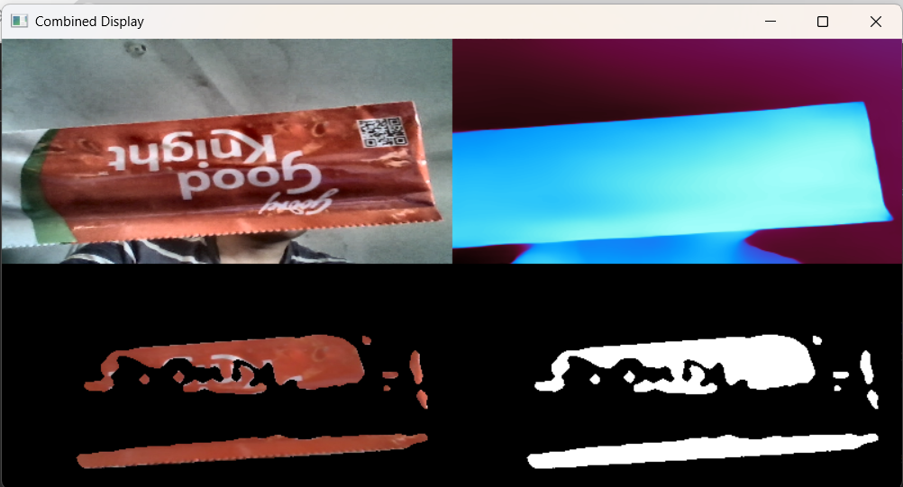

# DeepLunar

DeepLunar (Depth + Lunar) is an AI-powered, vision-guided lunar rover system designed for autonomous object detection and manipulation. It utilizes HSV-based color detection, Image Moments for orientation, and the Depth Anything Model for generating depth maps.

## Table of Contents

- [Features](#features)
- [Installation](#installation)
- [Usage](#usage)


## Features

- **HSV-Based Color Detection**: Identifies objects based on color segmentation using the Hue, Saturation, and Value (HSV) color space.
- **Image Moments for Orientation**: Computes image moments to determine the orientation and centroid of detected objects.
- **Depth Anything Model**: Generates depth maps to assess the distance of objects from the rover, facilitating navigation and manipulation.

## Installation

To set up DeepLunar on your local machine:

1. **Clone the Repository**:

    ```bash
    git clone https://github.com/RjDranzer/-DeepLunar.git
    ```

2. **Navigate to the Project Directory**:

    ```bash
    cd -DeepLunar
    ```

3. **Install Required Dependencies**:

    DeepLunar relies on several Python libraries. Install them using pip:

    '''bash
    !pip install opencv-python matplotlib numpy torch torchvision openvino ipywidgets
    '''

    Ensure you have Python and pip installed. If not, download and install [Python](https://www.python.org/downloads/).

## Usage

To run the DeepLunar system:

1. **Launch the Jupyter Notebook**:

    The main code is contained within a Jupyter Notebook. Start Jupyter Notebook by running:

    ```bash
    jupyter notebook
    ```

2. **Open the Notebook**:

    In the Jupyter interface, open `Final_code.ipynb`.

3. **Execute the Notebook**:

    Follow the instructions within the notebook to execute each cell. This will initialize the rover's vision system, perform object detection, and generate depth maps.


#### Here is a sample of DeepLunar in action


